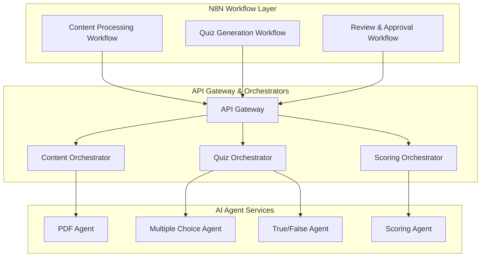

# API Reference

The Dynamic Quiz Generator provides a comprehensive REST API for integrating AI-powered quiz generation, delivery, and analytics into your applications. The API is built around an **orchestrated agent architecture** that coordinates multiple specialized AI agents through workflow management.

## Architecture Overview

The API operates through three layers:

### 1. Workflow Orchestration Layer
**N8N-powered workflows** manage high-level business processes:
- Content ingestion and processing pipelines
- Quiz generation and review workflows  
- Learner assessment and recommendation flows
- Human-in-the-loop approval processes

### 2. Agent Coordination Layer
**Custom orchestrator services** coordinate specialized AI agents:
- **Content Orchestrator**: Routes content to PDF, HTML, and video transcript agents
- **Quiz Orchestrator**: Coordinates multiple question generation agents
- **Scoring Orchestrator**: Manages automated and AI-assisted scoring

### 3. Individual Agent Services
**Containerized AI agents** handle specific tasks:
- Content processing agents (PDF, HTML, Video Transcript)
- Question generation agents (Multiple Choice, True/False, Fill-in-Blank, Short Answer)
- Scoring and analysis agents



## API Organization

The API is organized around workflow-driven endpoints that support this orchestrated architecture:

- **Workflow Management**: Control and monitor N8N workflows
- **Content Processing**: Upload content and trigger processing workflows
- **Quiz Generation**: Initiate quiz generation with agent coordination
- **Review Management**: Human-in-the-loop review and approval processes
- **Quiz Delivery**: Present quizzes to learners and collect responses
- **Results & Analytics**: Retrieve quiz results and learner progress
- **Agent Monitoring**: Monitor agent health and performance

## Base URL

```
https://api.dynamicquiz.go1.com/v1
```

## Authentication

All API endpoints require authentication using Bearer tokens:

```bash
curl -H "Authorization: Bearer YOUR_API_TOKEN" \
  https://api.dynamicquiz.go1.com/v1/quiz
```

## Response Format

All API responses follow a consistent JSON format:

```json
{
  "success": true,
  "data": {
    // Response data
  },
  "pagination": {
    // Pagination info (for list endpoints)
  }
}
```

## Error Handling

Error responses include detailed information:

```json
{
  "success": false,
  "error": {
    "code": "INVALID_CONTENT",
    "message": "Content format not supported",
    "details": {
      "supportedFormats": ["html", "pdf", "transcript"]
    }
  }
}
```

## Rate Limiting

API requests are rate limited to:
- **100 requests per minute** for content processing
- **1000 requests per minute** for quiz delivery
- **500 requests per minute** for analytics

## Getting Started

<Card title="Quick Start Guide" icon="rocket" href="/quickstart">
  Get up and running with the API in 5 minutes
</Card>

## Next Steps

Explore the API endpoints to integrate quiz functionality into your application. Start with content management to upload your first piece of content for quiz generation.

> **Note**: API documentation is actively being developed. Check back frequently for updates.