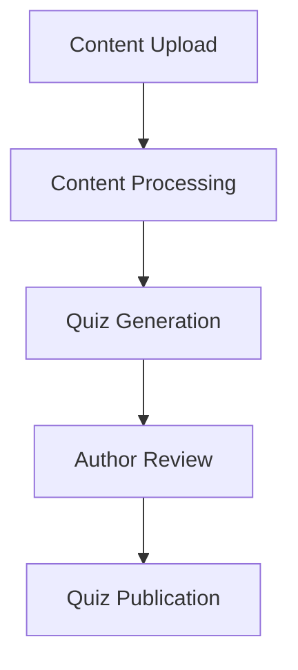

# Feature Planning 003: Developer & Technical Documentation

## Feature Overview

Create comprehensive technical documentation to guide development of the Dynamic Quiz Generator MVP. Focus on architecture, data models, user flows, and API specifications that developers need to build the system.

## Objectives

1. Document the modular agent system architecture from the PRD
2. Create detailed data models and content flow mappings
3. Define user flows for learners and content authors
4. Specify API endpoints and data contracts
5. Provide detailed agent and orchestrator specifications

## Scope

**Focus on MVP requirements only** - features needed for October 2025 release:
- Quiz generation from content
- Multiple question types (MC, T/F, Fill-blank, Short answer)
- Basic scoring and recommendations
- Simple learner profile storage

**Out of scope for this phase:**
- Admin dashboards
- Advanced analytics
- Full authentication integration
- Rich media processing

## Technical Approach

### 1. System Architecture Documentation

#### Core Components to Document
```
Content Ingestion → Quiz Generation → Review Interface → Quiz Delivery → Results Analysis
```

**Files to create:**
- `technical/architecture/system-overview.mdx` - High-level architecture diagram
- `technical/architecture/agent-orchestration.mdx` - How agents coordinate
- `technical/architecture/data-flow.mdx` - Content → Quiz → Results flow

#### Architecture Diagrams Needed
1. **System Overview**: End-to-end data flow
2. **Agent Architecture**: Modular components and interactions
3. **Quiz Generation Pipeline**: Content → Questions workflow
4. **Deployment Architecture**: Infrastructure and services

### 2. Data Models & Mappings

#### Core Data Entities
```typescript
// Content representation
interface ContentDocument {
  id: string;
  type: 'html' | 'pdf' | 'transcript';
  title: string;
  content: string;
  metadata: ContentMetadata;
  topics: Topic[];
}

// Quiz structure
interface Quiz {
  id: string;
  contentId: string;
  questions: Question[];
  settings: QuizSettings;
  status: 'draft' | 'review' | 'published';
}

// Question types
interface Question {
  id: string;
  type: 'multiple_choice' | 'true_false' | 'fill_blank' | 'short_answer';
  topic: string;
  difficulty: 'easy' | 'medium' | 'hard';
  question: string;
  options?: string[]; // for MC
  correctAnswer: string | string[];
  explanation?: string;
}
```

**Files to create:**
- `technical/data-models/content-schema.mdx` - Content ingestion data structures
- `technical/data-models/quiz-schema.mdx` - Quiz and question data structures
- `technical/data-models/results-schema.mdx` - Results and analytics data structures

### 3. User Flow Documentation

#### Critical User Journeys
1. **Content Author Flow**: Upload content → Review AI questions → Approve/Edit → Publish
2. **Learner Flow**: Access quiz → Answer questions → View results → Get recommendations
3. **System Flow**: Content processing → Question generation → Scoring → Recommendation

**Files to create:**
- `technical/user-flows/content-author-journey.mdx` - Author workflow with sequence diagrams
- `technical/user-flows/learner-journey.mdx` - Learner experience flow
- `technical/user-flows/system-processing.mdx` - Backend processing workflows

### 4. API Specifications

#### Core API Endpoints for MVP

**Content Management**
```
POST /api/content                   # Upload content
GET  /api/content/{id}             # Retrieve content
PUT  /api/content/{id}/status      # Update processing status
```

**Quiz Generation**
```
POST /api/quiz/generate            # Generate quiz from content
GET  /api/quiz/{id}               # Get quiz details
PUT  /api/quiz/{id}               # Update quiz (author edits)
POST /api/quiz/{id}/publish       # Publish approved quiz
```

**Quiz Taking**
```
POST /api/quiz/{id}/session       # Start quiz session
POST /api/quiz/session/{id}/answer # Submit answer
POST /api/quiz/session/{id}/complete # Complete quiz
GET  /api/quiz/session/{id}/results  # Get results
```

**Files to create:**
- `api-reference/content-management.mdx` - Content upload and processing
- `api-reference/quiz-generation.mdx` - Quiz creation and editing
- `api-reference/quiz-delivery.mdx` - Quiz taking and submission
- `api-reference/results.mdx` - Results and recommendations

### 5. Agent & Orchestrator Specifications

#### Detailed Agent Documentation

**Quiz Generation Agents**
- Multiple Choice Generator Agent
- True/False Generator Agent  
- Fill-in-the-Blank Generator Agent
- Short Answer Generator Agent

**Orchestrators**
- Content Ingestion Orchestrator
- Quiz Composition Orchestrator

**Files to create:**
- `technical/agents/content-ingestion-orchestrator.mdx`
- `technical/agents/quiz-composition-orchestrator.mdx`
- `technical/agents/multiple-choice-generator.mdx`
- `technical/agents/true-false-generator.mdx`
- `technical/agents/fill-blank-generator.mdx`
- `technical/agents/short-answer-generator.mdx`

## Implementation Steps

### Phase 1: Architecture Foundation (Week 1)
1. Create system architecture overview
2. Document core data models
3. Set up basic navigation structure in docs.json

### Phase 2: User Flows & Processes (Week 2)  
1. Document content author workflow
2. Document learner journey
3. Create sequence diagrams for key processes

### Phase 3: API Specifications (Week 3)
1. Define API endpoints and data contracts
2. Create OpenAPI specification
3. Add request/response examples

### Phase 4: Agent Specifications (Week 4)
1. Document each agent's responsibilities
2. Define agent interfaces and communication
3. Specify orchestration logic

## Content Structure for Navigation

```json
{
  "tab": "Technical Documentation",
  "groups": [
    {
      "group": "Architecture",
      "pages": [
        "technical/architecture/system-overview",
        "technical/architecture/agent-orchestration", 
        "technical/architecture/data-flow"
      ]
    },
    {
      "group": "Data Models",
      "pages": [
        "technical/data-models/content-schema",
        "technical/data-models/quiz-schema",
        "technical/data-models/results-schema"
      ]
    },
    {
      "group": "User Flows",
      "pages": [
        "technical/user-flows/content-author-journey",
        "technical/user-flows/learner-journey",
        "technical/user-flows/system-processing"
      ]
    },
    {
      "group": "Agent Specifications",
      "pages": [
        "technical/agents/content-ingestion-orchestrator",
        "technical/agents/quiz-composition-orchestrator",
        "technical/agents/multiple-choice-generator",
        "technical/agents/true-false-generator",
        "technical/agents/fill-blank-generator",
        "technical/agents/short-answer-generator"
      ]
    }
  ]
}
```

## Acceptance Criteria

### Must Have
- [ ] Complete system architecture with visual diagrams
- [ ] All core data models documented with TypeScript interfaces
- [ ] Content author and learner user flows documented
- [ ] API endpoints specified with request/response examples
- [ ] Each agent's role and interface documented

### Should Have
- [ ] Sequence diagrams for critical workflows
- [ ] Error handling and edge cases documented
- [ ] Performance considerations noted
- [ ] Security requirements outlined

### Nice to Have
- [ ] Interactive API documentation with examples
- [ ] Code samples for common integration patterns
- [ ] Troubleshooting guides for developers

## Key Documentation Features

### Mermaid Diagrams
Use Mermaid for all architecture and flow diagrams:


### Code Examples
Provide TypeScript interfaces and examples:
```typescript
// Example API request
const quiz = await fetch('/api/quiz/generate', {
  method: 'POST',
  body: JSON.stringify({ contentId: '123' })
});
```

### Interactive Elements
- Collapsible sections for detailed specifications
- Tabs for different programming languages
- Cards for agent summaries

## Success Metrics

1. **Developer Onboarding**: New developers can understand the system in < 2 hours
2. **Implementation Clarity**: All MVP features have clear technical specifications
3. **API Usability**: Developers can integrate APIs without additional clarification
4. **Architecture Understanding**: Team aligned on system design and data flows

## Dependencies

- PRD document (already available)
- System architecture decisions
- Database schema design
- API framework selection
- Agent implementation technology choices

## Timeline Alignment

This documentation supports the MVP development timeline:
- **July 2025**: Architecture and design documentation ready
- **August 2025**: API specs ready for backend development
- **September 2025**: Agent specifications ready for AI integration
- **October 2025**: Complete technical documentation for MVP release

## Notes

- Focus on actionable documentation developers can use immediately
- Keep diagrams simple and focused on MVP scope
- Document decisions and rationale, not just specifications
- Plan for easy updates as implementation evolves