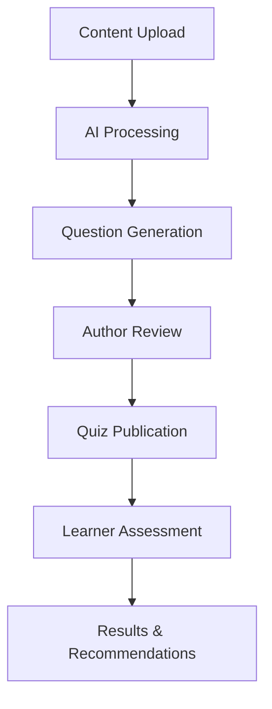

# Feature Planning 005: Project Overview & PRD Integration

## Feature Overview

Create a developer-friendly version of the Project Requirements Document (PRD) that provides essential project context, goals, and requirements. This should be the first thing developers read to understand what they're building and why.

## Objectives

1. Make the PRD accessible and discoverable in the documentation
2. Present project context in a developer-friendly format
3. Provide clear understanding of users, goals, and MVP scope
4. Establish foundation knowledge before technical documentation
5. Align development team on project vision and requirements

## Current PRD Analysis

The existing PRD (`/docs/PRD.md`) contains:
- Project objectives and background
- Target users and user goals
- MVP features and functionality
- System architecture overview
- Timeline and success metrics
- Risks and dependencies

## Technical Approach

### 1. Content Strategy

#### Developer-Focused Sections
```
Project Overview
├── What We're Building - Clear product description
├── Who It's For - User personas and use cases  
├── Why It Matters - Business value and learning outcomes
├── MVP Scope - What's included and excluded
├── Success Metrics - How we measure success
├── Timeline - Key milestones and MVP target
└── Architecture Overview - High-level system design
```

#### Content Transformation
- **Convert business language to technical context**
- **Add developer-relevant details** 
- **Include technical constraints and requirements**
- **Highlight integration points and dependencies**

### 2. Navigation Integration

#### Primary Location
Add to "Getting Started" tab as the first page:

```json
{
  "tab": "Getting Started",
  "groups": [
    {
      "group": "Overview",
      "pages": [
        "project-overview",    // NEW - PRD content
        "index",              // Current landing page
        "quickstart"          // Current quickstart
      ]
    }
  ]
}
```

#### Cross-References
Link from other key pages:
- Landing page → Project overview
- Architecture docs → Project context
- API reference → Use cases and user flows

### 3. Content Structure

#### Page 1: Project Overview (`project-overview.mdx`)
```mdx
---
title: Project Overview
description: Understanding the Dynamic Quiz Creator project, users, and goals
---

# Dynamic Quiz Creator - Project Overview

## What We're Building

AI-powered assessment tool for personalized learning paths...

## Target Users & Use Cases

### Primary Users
1. **Learners** - Assess knowledge before starting courses
2. **Content Authors** - Review and approve AI-generated questions  
3. **Administrators** - Manage quiz settings (future)

### User Goals
- Skip unnecessary content based on existing knowledge
- Gain awareness of knowledge gaps
- Save time by focusing only on new material
- Track knowledge growth over time

## MVP Features & Scope

### Included in MVP
- AI-generated questions from content (HTML, PDF, transcripts)
- Multiple question types (MC, T/F, Fill-blank, Short answer)
- Basic scoring and topic-based recommendations
- Simple learner profile storage
- Author review and edit capability

### Explicitly Out of Scope (MVP)
- Admin dashboards and analytics
- Full authentication integration  
- Rich media processing
- Advanced adaptive questioning

## System Architecture Overview

[Include high-level architecture diagram and brief explanation]

## Timeline & Milestones

- **MVP Target**: October 2025
- **Current Phase**: Documentation and architecture (July 2025)
- **Next Phase**: Development and AI integration (Aug-Sep 2025)

## Success Metrics

- % of learners who take pre-course assessments
- Learner satisfaction with quiz feature
- Quality of AI-generated questions
```

### 4. Developer-Specific Enhancements

#### Technical Context Additions
- **Technology constraints** (Node.js 18+, AI model requirements)
- **Integration requirements** (REST APIs, data formats)
- **Performance considerations** (rate limiting, processing time)
- **Security requirements** (data privacy, content protection)

#### Development-Relevant Information
- **Data flow examples** for each user journey
- **API surface area** overview
- **Third-party dependencies** and services
- **Deployment and infrastructure** considerations

### 5. Visual Elements

#### Diagrams and Visual Aids


#### User Flow Examples
- **Learner Journey**: Course access → Quiz → Results → Decision
- **Author Journey**: Content upload → AI generation → Review → Publish
- **System Flow**: Processing pipeline from content to recommendations

## Implementation Steps

### Phase 1: Content Creation (Day 1-2)
1. Create `project-overview.mdx` with developer-focused PRD content
2. Add visual elements and diagrams
3. Update navigation in docs.json

### Phase 2: Integration (Day 3)
1. Link from landing page and quickstart
2. Add cross-references to upcoming technical docs
3. Test all navigation links

### Phase 3: Validation (Day 4)
1. Review content for technical accuracy
2. Ensure alignment with original PRD objectives
3. Validate that developers have sufficient context

## Content Outline

### Detailed Page Structure

```
# Dynamic Quiz Creator - Project Overview

## Executive Summary
- One-paragraph project description
- Key value proposition for learners and organizations

## The Problem We're Solving
- Current challenges with linear learning paths
- Knowledge gaps and time inefficiency
- Need for personalized assessment

## Our Solution
- AI-powered pre-assessment approach
- Topic-based scoring and recommendations
- Integration with existing learning platforms

## Target Users
### Learners
- Goals, pain points, success criteria
- User journey and interaction patterns

### Content Authors  
- Role in quiz creation and quality assurance
- Workflow and approval process

### Administrators (Future)
- Analytics and management capabilities
- Integration and configuration needs

## MVP Feature Breakdown
### Core Functionality
- Content ingestion and processing
- AI question generation engine
- Multiple question type support
- Scoring and recommendation logic

### User Interfaces
- Learner quiz-taking experience
- Author review and editing tools
- Basic reporting and analytics

### Technical Requirements
- API endpoints and data formats
- Performance and scalability needs
- Security and privacy considerations

## System Architecture Overview
- High-level component diagram
- Data flow illustration
- Integration points and dependencies

## Development Timeline
- MVP milestones and deliverables
- Key decision points and dependencies
- Testing and validation phases

## Success Criteria
- Technical metrics (performance, reliability)
- User experience metrics (adoption, satisfaction)
- Business metrics (time savings, learning outcomes)

## Risks & Mitigation Strategies
- Technical risks and solutions
- User adoption challenges
- Quality and accuracy concerns

## Getting Started for Developers
- Next steps for technical implementation
- Key documentation sections to review
- Development environment setup
```

## Acceptance Criteria

### Must Have
- [ ] Project overview accessible from main navigation
- [ ] Clear explanation of what developers are building
- [ ] User personas and use cases documented
- [ ] MVP scope clearly defined with inclusions/exclusions
- [ ] High-level architecture overview included
- [ ] Timeline and milestones established

### Should Have
- [ ] Visual diagrams for user flows and architecture
- [ ] Technical requirements and constraints documented
- [ ] Cross-references to technical documentation
- [ ] Developer-friendly language and context

### Nice to Have
- [ ] Interactive elements (collapsible sections, tabs)
- [ ] Links to external resources and references
- [ ] Technical decision rationale explained

## Files to Create

### New Documentation
- `project-overview.mdx` - Main PRD content for developers

### Configuration Updates
- `docs.json` - Add project-overview to navigation

### Cross-Reference Updates
- `index.mdx` - Link to project overview
- `quickstart.mdx` - Reference project context

## Success Metrics

1. **Developer Onboarding**: New developers understand project goals within 15 minutes
2. **Context Clarity**: Technical decisions can be traced back to user requirements  
3. **Alignment**: Development team aligned on MVP scope and priorities
4. **Foundation**: Provides context for all subsequent technical documentation

## Dependencies

- Original PRD content and requirements
- Stakeholder input on developer-specific needs
- Architecture decisions and technical constraints
- Timeline and milestone definitions

## Benefits

1. **Faster Onboarding**: Developers quickly understand project context
2. **Better Decisions**: Technical choices informed by user and business requirements
3. **Scope Clarity**: Clear boundaries on what's included in MVP
4. **Team Alignment**: Shared understanding of goals and success criteria
5. **Documentation Foundation**: Context for all technical documentation that follows

## Next Steps After Completion

This project overview provides the foundation for:
- System architecture documentation
- API specification development  
- User flow and data model definition
- Development planning and estimation

The project overview should be completed before diving into detailed technical documentation to ensure all development work is grounded in user needs and business requirements.