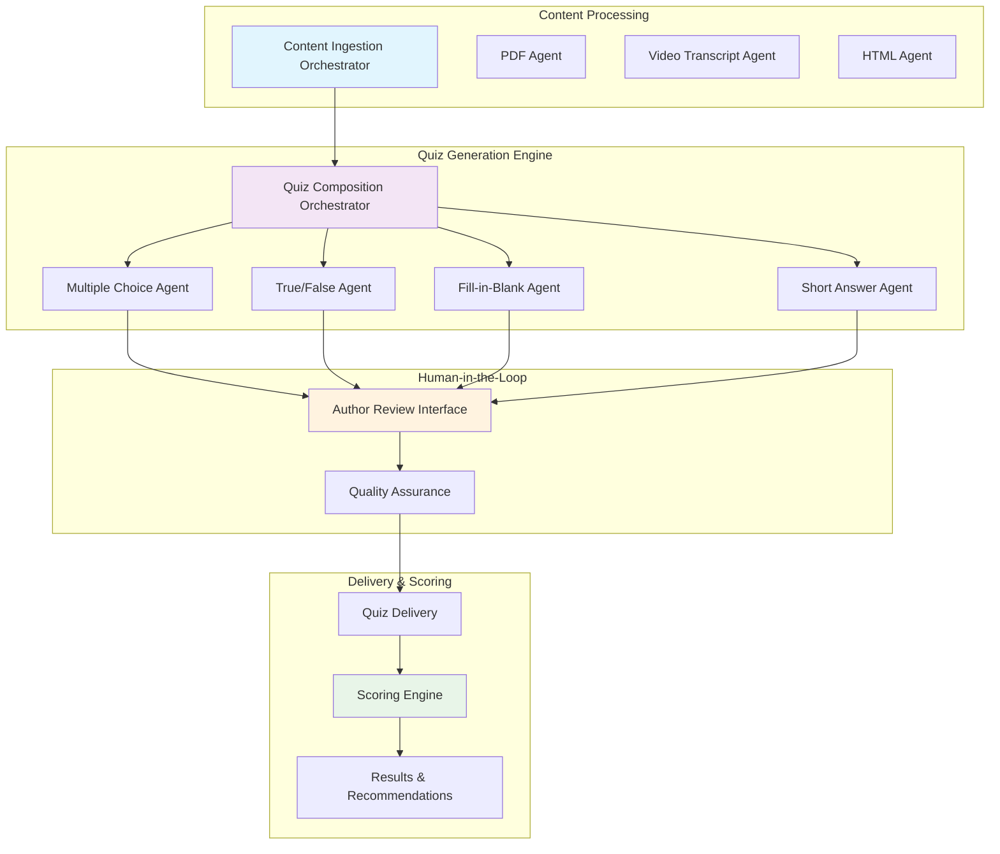

# Dynamic Quiz Creator - Project Overview

## Executive Summary

The Dynamic Quiz Creator is an AI-powered assessment tool that enables learners to evaluate their existing knowledge before starting courses. By generating quizzes from course content, it helps learners skip unnecessary material, identify knowledge gaps, and optimize their learning journey.

**MVP Target**: October 2025

## The Problem We're Solving

Traditional learning paths are linear and don't account for learners' existing knowledge, leading to:

- **Time inefficiency**: Learners spend time on content they already know
- **Poor engagement**: Redundant material reduces motivation and completion rates  
- **Knowledge gaps**: No systematic way to identify what learners actually need to learn
- **One-size-fits-all**: Content delivery doesn't adapt to individual knowledge levels

## Our Solution

An AI-powered pre-assessment system that:

1. **Analyzes course content** (HTML, PDF, video transcripts) to understand key concepts
2. **Generates targeted quizzes** using multiple question types to assess knowledge
3. **Provides topic-based scoring** to identify strengths and gaps
4. **Recommends personalized paths** - skip known content, focus on gaps

## Target Users & Use Cases

### 👨‍🎓 Learners (Primary Users)
**Role**: Individuals taking courses who want to optimize their learning time

**Goals**:
- Skip content they already know
- Identify knowledge gaps before starting
- Save time by focusing only on new material
- Track knowledge growth over time

**User Journey**:
1. Access course → See optional pre-assessment
2. Take AI-generated quiz → Get immediate results
3. Review topic breakdown → Make informed decisions
4. Proceed with personalized learning path

### ✏️ Content Authors (Secondary Users) 
**Role**: Subject matter experts who create and maintain course content

**Goals**:
- Ensure AI-generated questions are accurate and relevant
- Maintain quality control over assessments
- Understand how learners interact with their content

**User Journey**:
1. Upload/connect content → AI generates quiz questions
2. Review generated questions → Edit or approve
3. Publish approved quiz → Monitor learner performance

### 👨‍💼 Administrators (Future Users - V2+)
**Role**: Learning managers who oversee learning programs

**Goals**:
- Track learner performance trends
- Optimize course content based on assessment data
- Manage quiz settings and configurations

## MVP Features & Scope

### ✅ Included in MVP

<CardGroup cols={2}>
  <Card title="AI Question Generation" icon="robot">
    Generate quizzes from content (HTML, PDF, video transcripts)
  </Card>
  <Card title="Multiple Question Types" icon="list-check">
    Multiple choice, true/false, fill-in-the-blank, short answer
  </Card>
  <Card title="Content Review Interface" icon="eye">
    Authors can review, edit, and approve AI-generated questions
  </Card>
  <Card title="Basic Scoring & Recommendations" icon="chart-line">
    Topic-based scoring with skip/continue recommendations
  </Card>
</CardGroup>

### ❌ Explicitly Out of Scope (MVP)

- Admin dashboards and advanced analytics
- Full authentication integration with Go1 SSO
- API-based content ingestion from Go1's course catalog
- Rich media processing (complex PDFs, interactive content)
- In-depth content-skipping automation within courses
- Real-time adaptive questioning

## System Architecture Overview

### Agentic Design Approach

The Dynamic Quiz Creator uses a **modular agent architecture** where specialized AI agents handle different aspects of quiz generation, coordinated by orchestration layers.

### Key Architectural Principles

**🤖 Agent Specialization**
- Each question type has a dedicated AI agent optimized for that format
- Agents can be independently developed, tested, and improved
- Modular design allows adding new question types without system redesign

**🎯 Orchestration Layers**
- **Content Orchestrator**: Routes different content types to appropriate processing agents
- **Quiz Orchestrator**: Coordinates multiple question agents to create balanced assessments
- **Ensures consistency** across different agents and question types

**👨‍🎓 Human-in-the-Loop Design**
- **Authors maintain control**: All AI-generated questions require human review before publication
- **Quality gates**: Built-in review workflow prevents low-quality questions from reaching learners
- **Iterative improvement**: Author feedback trains and improves AI agent performance over time

**🔄 Feedback Loops**
- Author edits and approvals feed back into agent training
- Learner performance data informs question difficulty and relevance
- Continuous improvement without manual retraining

<Callout type="info">
  **Detailed Technical Architecture**: For implementation details, agent specifications, and data models, see the [Technical Architecture Documentation](/technical/architecture/system-overview).
</Callout>

### Core Components

<CardGroup cols={2}>
  <Card title="Content Ingestion Layer" icon="upload">
    **Status**: Simulated in MVP via manual uploads
    
    **Components**:
    
    • PDF Ingestor Agent
    
    • Video Transcript Agent  
    
    • Content Ingestion Orchestrator
    
    • Unified content schema normalization
  </Card>

  <Card title="Quiz Generation Engine" icon="magic">
    **Status**: Fully implemented in MVP
    
    **Components**:
    
    • Multiple Choice Generator
    
    • True/False Generator
    
    • Fill-in-the-Blank Generator
    
    • Short Answer Generator
    
    • Quiz Composition Orchestrator
  </Card>

  <Card title="Quiz Review Interface" icon="eye">
    **Status**: Required for MVP
    
    **Components**:
    
    • Author review and editing tools
    
    • Question approval workflow
    
    • Learner experience preview
    
    • Basic quality review tools
  </Card>

  <Card title="Quiz Delivery & Scoring" icon="play">
    **Status**: Required for MVP
    
    **Components**:
    
    • Quiz UI rendering engine
    
    • Response capture and validation
    
    • Automated scoring for objective questions
    
    • AI-assisted scoring for subjective answers
  </Card>
</CardGroup>

## Technical Requirements

### Technology Stack
- **Backend**: Node.js 18+, REST APIs
- **AI/ML**: Integration with question generation models
- **Frontend**: React-based quiz interfaces
- **Data**: Structured content processing, quiz storage

### Performance Considerations
- **Content Processing**: Reasonable processing time for typical course content
- **Quiz Generation**: Timely generation of assessment questions
- **Quiz Taking**: Responsive user interface for question navigation
- **Results**: Prompt scoring and feedback delivery

### Security & Privacy
- Content protection and access control
- Learner data privacy compliance
- Secure AI model integration
- API authentication and authorization

## Timeline & Milestones

<Steps>
  <Step title="July 2025: Design & Architecture">
    Complete system design and technical documentation
  </Step>
  <Step title="August 2025: Core Development">
    Build quiz generation engine and content processing
  </Step>
  <Step title="September 2025: Author Tools & Testing">
    Implement review interface and conduct user testing
  </Step>
  <Step title="October 2025: MVP Release">
    Deploy proof-of-concept with core functionality
  </Step>
</Steps>

## Success Metrics

### Primary Success Indicators (from PRD)
- **Learner Adoption**: % of learners who choose to take the quiz before starting a course
- **User Satisfaction**: Learner satisfaction and NPS related to quiz feature

### Additional Success Indicators
- **Question Quality**: Author feedback on AI-generated question relevance
- **System Reliability**: Stable performance during pilot testing
- **Content Support**: Coverage of pilot content types (HTML, PDF, transcripts)
- **Learning Impact**: Measurement of course completion and engagement patterns

## Risks & Mitigation Strategies

| Risk Category | Risk Description | Mitigation Strategy | Priority |
|---------------|------------------|-------------------|----------|
| **AI Quality** | AI produces irrelevant or inaccurate questions | Human-in-the-loop review process with author approval required | High |
| **User Trust** | Learners don't trust AI recommendations to skip content | Transparent scoring breakdown and conservative recommendations | High |
| **Content Processing** | Varied content formats cause processing failures | Start with standardized content types, expand gradually | Medium |
| **Performance** | AI processing causes unacceptable delays | Asynchronous processing with progress indicators | Medium |
| **Adoption** | Low learner engagement with optional pre-assessments | Clear value proposition and transparent benefit communication | Medium |

## Dependencies

| Dependency Type | Requirement | Timing | Description |
|-----------------|-------------|---------|-------------|
| **External** | AI/ML models | MVP Critical | Question generation algorithms and APIs |
| **External** | Content processing libraries | MVP Critical | Parse HTML, PDF, and video transcript formats |
| **External** | Authentication systems | Future (V2+) | Go1 SSO and user management integration |
| **External** | LMS APIs | Future (V2+) | Learning management system integrations |
| **Internal** | Content standardization | MVP Critical | Unified schema and formatting processes |
| **Internal** | UI design & testing | MVP Critical | User interface components and usability validation |
| **Internal** | Performance optimization | MVP Required | System performance tuning and monitoring |
| **Internal** | Quality assurance | MVP Required | Testing processes and quality standards |

## Getting Started for Developers

Now that you understand the project context, here's where to dive deeper:

<CardGroup cols={2}>
  <Card title="System Architecture" href="/technical/architecture/system-overview" icon="sitemap">
    Detailed technical architecture and component design
  </Card>
  <Card title="API Reference" href="/api-reference/introduction" icon="code">
    Complete API documentation for integration
  </Card>
  <Card title="Quick Start" href="/quickstart" icon="rocket">
    Set up your development environment
  </Card>
  <Card title="Data Models" href="/technical/data-models/content-schema" icon="database">
    Content and quiz data structures
  </Card>
</CardGroup>

## Questions or Feedback?

- **Technical Issues**: [GitHub Issues](https://github.com/go1/dynamic-quiz-creator/issues)
- **Project Questions**: [support@go1.com](mailto:support@go1.com)
- **Documentation**: This site is actively developed - check back for updates