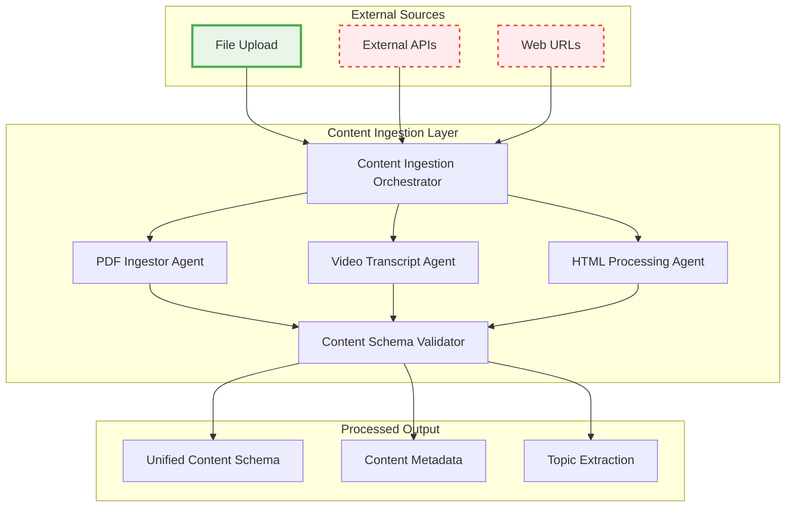
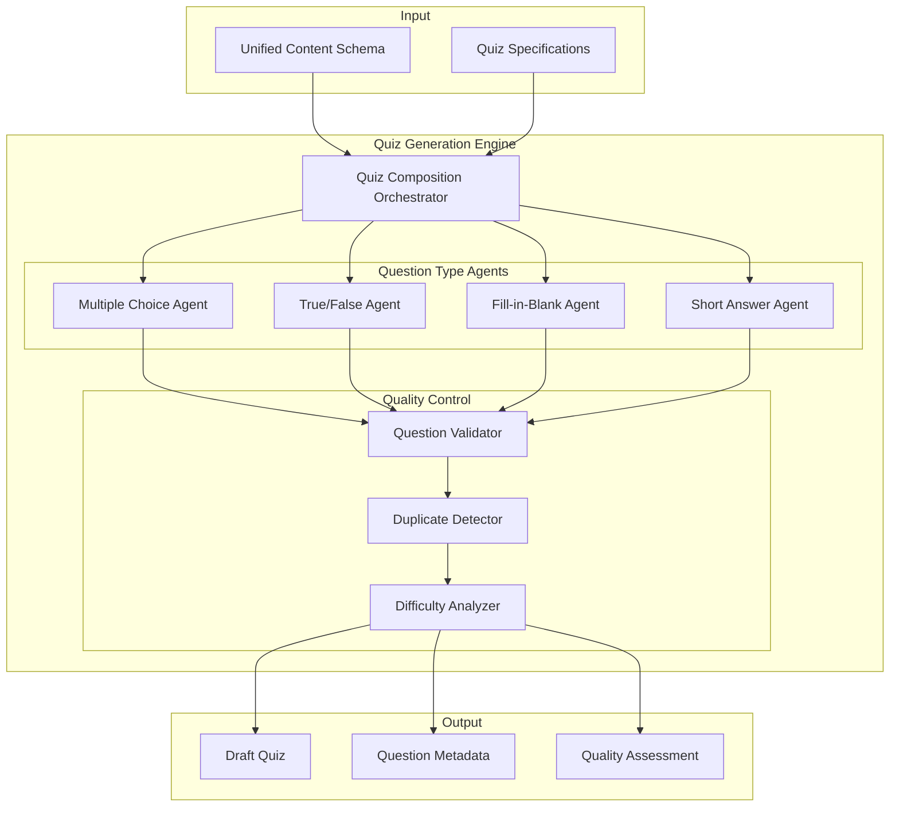
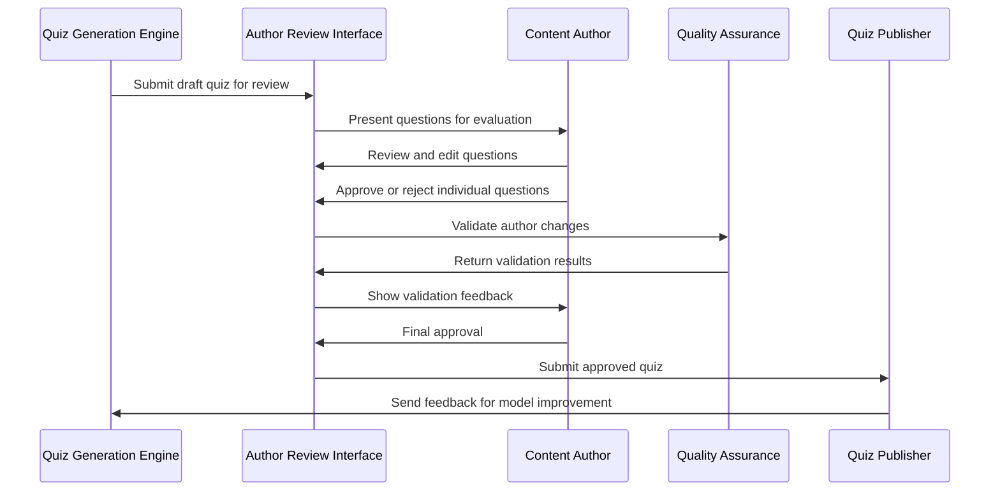
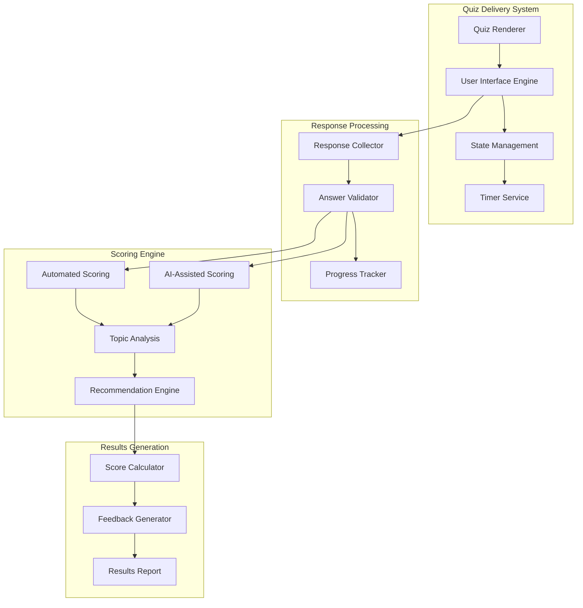
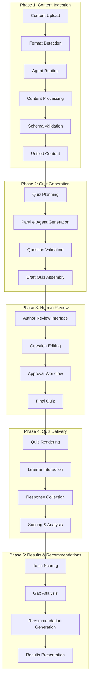
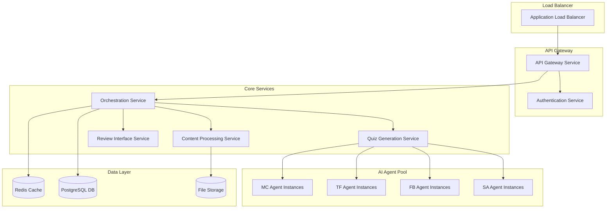

# System Architecture Overview

This document provides the complete technical architecture for the Dynamic Quiz Creator, including detailed agent specifications, data flows, and implementation guidelines.

<Callout type="info">
  **Prerequisites**: Review the [Project Overview](/project-overview) to understand the business context and high-level design approach before diving into technical details.
</Callout>

## Architecture Principles

### Modular Agent Design
- **Single Responsibility**: Each agent handles one specific task or question type
- **Independent Development**: Agents can be built, tested, and deployed separately
- **Extensibility**: New question types can be added without modifying existing agents
- **Fault Isolation**: Agent failures don't cascade to other system components

### Human-in-the-Loop Integration
- **Author Authority**: Humans maintain final approval over all AI-generated content
- **Quality Gates**: Multi-stage review process ensures content quality
- **Feedback Loops**: Human input continuously improves AI performance
- **Transparency**: Authors can see and understand AI decision-making

### Event-Driven Architecture
- **Asynchronous Processing**: Long-running AI operations don't block user interfaces
- **Scalability**: Components can scale independently based on load
- **Reliability**: Failed operations can be retried without losing state
- **Monitoring**: Each step in the pipeline can be tracked and measured

## System Components

### Content Ingestion Layer



**MVP Scope Legend**:
- 🟢 **Green (Solid Border)**: Included in MVP - File Upload
- 🔴 **Red (Dashed Border)**: Future versions - External APIs and Web URLs

#### Content Ingestion Orchestrator
**Responsibility**: Routes content to appropriate processing agents based on format detection

**Core Functions** (MVP focuses on file upload only):
- **Format Detection**: Analyze uploaded files to determine type (PDF, HTML, video transcript)
- **Agent Routing**: Delegate file content to specialized processing agents
- **Error Handling**: Manage failures and retry logic for file processing
- **Progress Tracking**: Provide status updates for long-running upload operations

**Implementation Interface**:
```typescript
interface ContentIngestionOrchestrator {
  processContent(content: ContentInput): Promise<ProcessingJob>
  getProcessingStatus(jobId: string): ProcessingStatus
  retryProcessing(jobId: string): Promise<ProcessingJob>
}

interface ContentInput {
  type: 'file'  // MVP: file upload only
  source: Buffer | File
  filename: string
  metadata?: ContentMetadata
}

interface ProcessingJob {
  id: string
  status: 'pending' | 'processing' | 'completed' | 'failed'
  progress: number
  result?: UnifiedContentSchema
  error?: ProcessingError
}
```

#### Specialized Content Agents

<CardGroup cols={2}>
  <Card title="PDF Ingestor Agent" icon="file-pdf">
    **Purpose**: Extract text and structure from PDF documents
    
    **Capabilities**:
    
    • Text extraction with formatting preservation
    
    • Table and list structure recognition
    
    • Image and diagram handling (future)
    
    • Multi-column layout processing
  </Card>

  <Card title="Video Transcript Agent" icon="video">
    **Purpose**: Process video transcripts and extract learning content
    
    **Capabilities**:
    
    • Timestamp-based content segmentation
    
    • Speaker identification and dialogue parsing
    
    • Topic boundary detection
    
    • Key concept extraction from spoken content
  </Card>

  <Card title="HTML Processing Agent" icon="code">
    **Purpose**: Parse HTML content and extract structured learning material
    
    **Capabilities**:
    
    • Semantic HTML structure analysis
    
    • Content vs navigation separation
    
    • Link and reference extraction
    
    • Multimedia content cataloging
  </Card>

  <Card title="Content Schema Validator" icon="check-circle">
    **Purpose**: Ensure all processed content meets unified schema requirements
    
    **Capabilities**:
    
    • Schema validation and normalization
    
    • Metadata enrichment and tagging
    
    • Quality scoring and content assessment
    
    • Topic and concept extraction
  </Card>
</CardGroup>

### Quiz Generation Engine



#### Quiz Composition Orchestrator
**Responsibility**: Coordinate multiple question type agents to create balanced assessments

**Core Functions**:
- **Question Mix Planning**: Determine optimal distribution of question types
- **Agent Coordination**: Manage parallel question generation across multiple agents
- **Quality Aggregation**: Combine individual question assessments into overall quiz quality
- **Balancing Logic**: Ensure appropriate difficulty distribution and topic coverage

**Configuration Interface**:
```typescript
interface QuizCompositionOrchestrator {
  generateQuiz(content: UnifiedContentSchema, spec: QuizSpecification): Promise<DraftQuiz>
  validateQuizBalance(quiz: DraftQuiz): QuizBalanceReport
  regenerateQuestions(quiz: DraftQuiz, criteria: RegenerationCriteria): Promise<DraftQuiz>
}

interface QuizSpecification {
  questionCount: number
  questionTypes: QuestionTypeDistribution[]
  difficultyTarget: 'easy' | 'medium' | 'hard' | 'mixed'
  topicCoverage: TopicWeight[]
  timeLimit?: number
}

interface QuestionTypeDistribution {
  type: 'multiple_choice' | 'true_false' | 'fill_blank' | 'short_answer'
  percentage: number
  minCount: number
  maxCount: number
}
```

#### Question Generation Agents

Each agent specializes in creating high-quality questions for its specific format:

| Agent Type | Primary Function | Key Algorithms | Quality Metrics |
|------------|------------------|----------------|-----------------|
| **Multiple Choice** | Generate MC questions with plausible distractors | Distractor generation, Answer key validation | Distractor plausibility, Answer accuracy |
| **True/False** | Create binary assessment statements | Fact extraction, Negation handling | Statement clarity, Factual accuracy |
| **Fill-in-Blank** | Identify key terms for completion | Keyword extraction, Context preservation | Blank difficulty, Context sufficiency |
| **Short Answer** | Generate open-ended questions | Concept identification, Question framing | Answer scope, Evaluation criteria |

### Human-in-the-Loop Review System



#### Author Review Interface
**Responsibility**: Provide tools for content authors to review, edit, and approve AI-generated questions

**Core Features**:
- **Question Preview**: Show questions exactly as learners will see them
- **Bulk Operations**: Approve/reject multiple questions at once
- **Edit Capabilities**: Modify question text, answers, and explanations
- **Quality Indicators**: Display AI confidence scores and quality metrics
- **Preview Mode**: Test quiz experience from learner perspective

**Review Workflow**:
```typescript
interface ReviewWorkflow {
  // Review session management
  startReviewSession(quizId: string): Promise<ReviewSession>
  getQuestionBatch(sessionId: string, batchSize: number): Promise<QuestionBatch>
  
  // Question evaluation
  approveQuestion(questionId: string, feedback?: string): Promise<void>
  rejectQuestion(questionId: string, reason: string): Promise<void>
  editQuestion(questionId: string, changes: QuestionChanges): Promise<Question>
  
  // Bulk operations
  bulkApprove(questionIds: string[], criteria?: ApprovalCriteria): Promise<BulkResult>
  requestRegeneration(questionIds: string[], requirements: RegenerationRequest): Promise<void>
  
  // Session completion
  completeReview(sessionId: string): Promise<ReviewSummary>
}
```

### Quiz Delivery & Scoring System



#### Scoring Engine Specifications

**Automated Scoring (Objective Questions)**:
- **Multiple Choice**: Exact match comparison with correct answer
- **True/False**: Binary evaluation with confidence scoring
- **Fill-in-Blank**: Fuzzy matching with synonym and spelling tolerance

**AI-Assisted Scoring (Subjective Questions)**:
- **Short Answer**: Semantic similarity comparison with model answers
- **Partial Credit**: Graduated scoring based on answer completeness
- **Context Awareness**: Scoring that considers question context and difficulty

**Topic-Based Analysis**:
```typescript
interface TopicScoring {
  calculateTopicScores(responses: QuizResponse[]): TopicScoreMap
  identifyKnowledgeGaps(scores: TopicScoreMap, threshold: number): KnowledgeGap[]
  generateRecommendations(gaps: KnowledgeGap[], content: ContentMap): Recommendation[]
}

interface TopicScoreMap {
  [topicId: string]: {
    score: number
    confidence: number
    questionCount: number
    correctCount: number
  }
}

interface Recommendation {
  type: 'skip' | 'review' | 'focus'
  topic: string
  confidence: number
  reasoning: string
  suggestedActions: string[]
}
```

## Data Flow Architecture

### End-to-End Processing Pipeline



### Critical Data Flows

#### Content Processing Flow
1. **Input Validation**: Verify content format and accessibility
2. **Content Extraction**: Extract text, structure, and metadata
3. **Topic Identification**: Analyze content for key concepts and topics
4. **Schema Normalization**: Convert to unified content representation
5. **Quality Assessment**: Evaluate content suitability for quiz generation

#### Question Generation Flow
1. **Content Analysis**: Identify potential question topics and difficulty levels
2. **Question Planning**: Determine question types and distribution
3. **Parallel Generation**: Multiple agents create questions simultaneously
4. **Quality Filtering**: Remove low-quality or duplicate questions
5. **Quiz Assembly**: Combine questions into coherent assessment

#### Review and Approval Flow
1. **Review Assignment**: Present questions to appropriate subject matter experts
2. **Author Evaluation**: Human review of AI-generated content
3. **Iterative Improvement**: Edit and refine questions based on feedback
4. **Quality Validation**: Ensure all questions meet publication standards
5. **Final Approval**: Author sign-off for quiz publication

## Implementation Guidelines

### Development Priorities

| Priority | Component | Rationale | Dependencies |
|----------|-----------|-----------|--------------|
| **High** | Content Ingestion Orchestrator | Foundation for all other processing | File handling, format detection |
| **High** | Quiz Composition Orchestrator | Core coordination logic | Agent interfaces, question schemas |
| **High** | Multiple Choice Agent | Most common question type, well-defined format | NLP libraries, answer validation |
| **Medium** | Author Review Interface | Critical for MVP but can use simple UI initially | Web framework, state management |
| **Medium** | True/False Agent | Simpler than MC, good for early testing | Fact extraction, statement validation |
| **Low** | Fill-in-Blank Agent | More complex text processing requirements | Advanced NLP, context analysis |
| **Low** | Short Answer Agent | Requires sophisticated evaluation capabilities | Semantic analysis, scoring algorithms |

### Technology Stack Recommendations

**Backend Services**:
- **Node.js/Express**: Primary API and orchestration services
- **Python**: AI/ML agents and natural language processing
- **Redis**: Caching and session management
- **PostgreSQL**: Persistent data storage
- **Docker**: Containerization for agent deployment

**AI/ML Infrastructure**:
- **Transformers**: Pre-trained language models for question generation
- **spaCy/NLTK**: Natural language processing utilities
- **OpenAI API**: Enhanced question generation capabilities (if available)
- **Custom Models**: Domain-specific fine-tuned models

**Frontend Technologies**:
- **React**: Author review interface and learner quiz UI
- **TypeScript**: Type safety across frontend components
- **Material-UI**: Consistent design system
- **WebSocket**: Real-time progress updates

### Deployment Architecture



## Performance Considerations

### Scalability Requirements
- **Horizontal Scaling**: Agent pools can scale independently based on demand
- **Caching Strategy**: Aggressive caching of processed content and generated questions
- **Async Processing**: Long-running operations don't block user interfaces
- **Resource Management**: AI model loading and memory management optimization

### Monitoring & Observability
- **Agent Performance**: Track generation time, quality scores, and success rates
- **System Health**: Monitor service availability and response times
- **User Experience**: Track review completion times and approval rates
- **Quality Metrics**: Continuous assessment of question quality and relevance

## Security Considerations

### Content Protection
- **Access Control**: Role-based permissions for content access and quiz management
- **Data Encryption**: Encryption at rest and in transit for sensitive content
- **Audit Logging**: Comprehensive logging of all content access and modifications
- **Content Isolation**: Tenant isolation for multi-customer deployments

### AI Model Security
- **Model Validation**: Ensure AI models haven't been compromised or degraded
- **Input Sanitization**: Protect against malicious content injection
- **Output Filtering**: Validate AI-generated content for safety and appropriateness
- **Rate Limiting**: Prevent abuse of AI generation capabilities

## Next Steps

1. **Implementation Phase 1**: Build content ingestion and orchestration foundation
2. **Agent Development**: Implement Multiple Choice and True/False agents first
3. **Review Interface**: Create basic author review and approval workflow
4. **Integration Testing**: End-to-end testing with real content samples
5. **Performance Optimization**: Tune system for production-ready performance

<Callout type="warning">
  **Implementation Note**: This architecture supports the MVP scope defined in the project overview. Advanced features like real-time adaptive questioning and comprehensive analytics are intentionally deferred to future versions.
</Callout>

## Related Documentation

- [Project Overview](/project-overview) - Business context and user requirements
- [API Reference](/api-reference/introduction) - Detailed API specifications
- [Data Models](/technical/data-models/content-schema) - Content and quiz data structures
- [Development Guide](/technical/development/local-setup) - Local development setup